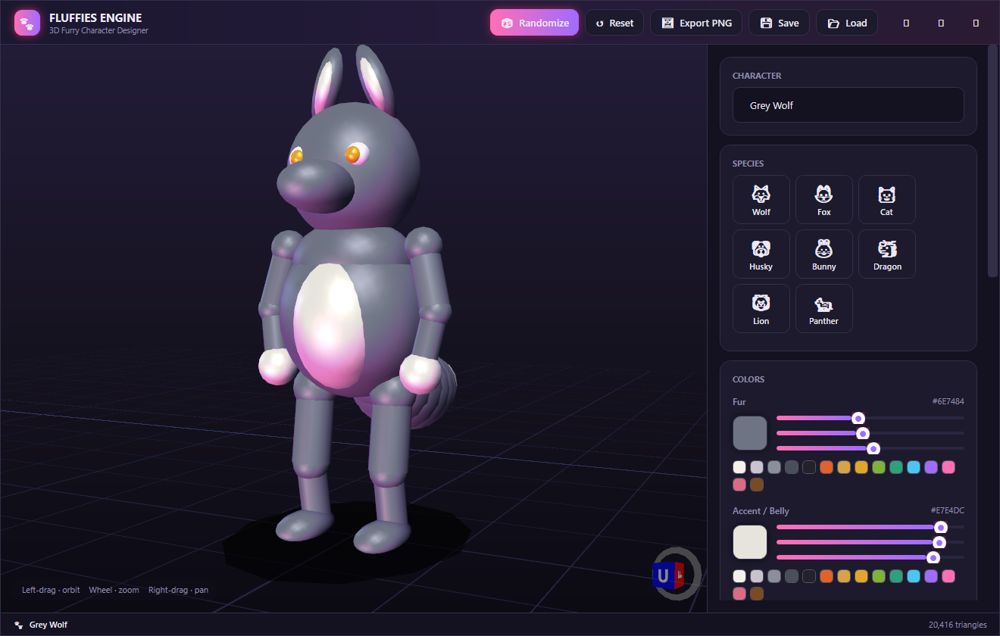
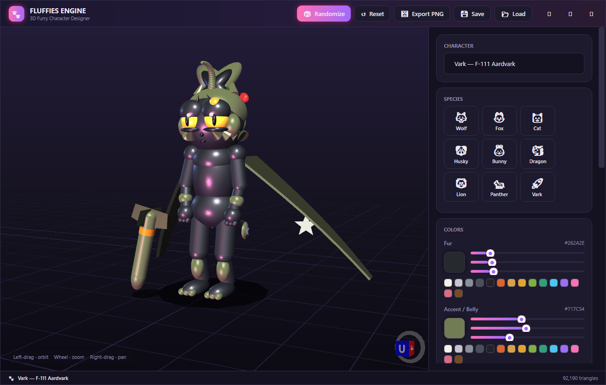

# 🐾 Fluffies Engine

A real-time **3D furry character designer** for Windows, built with **C# / WPF** and
[HelixToolkit](https://github.com/helix-toolkit/helix-toolkit). Pick a species, tweak the
colors and proportions with live sliders, and watch your character rebuild instantly in a
nicely lit 3D viewport. Export a render or save the character to a file.



> **🚀 Vark — F-111 Aardvark** (select the Vark preset): a detailed latex "Aeroket".
>
> 

## ✨ Features

- **Live 3D viewport** — orbit / zoom / pan, soft three-point lighting with a pink rim light,
  a ground grid and a fake contact shadow.
- **Species presets** — Wolf, Fox, Cat, Husky, Bunny, Dragon, Lion, Panther. Each fills in a
  full archetype you can then customize.
- **🚀 Vark — the "Aeroket"** — a bespoke, high-detail (tens of thousands of triangles) guest
  character built by a dedicated sculptor. Charcoal **latex/rubber** skin with wet specular
  highlights, huge half-lidded glowing-amber gradient eyes, a spiky olive ruff, swept ears with
  a red "remove before flight" flag, an antenna ahoge, a golden sensor dome, military camo, swept
  **wing membranes with USAF star roundels**, a banded tail and a leaning **"Tuna" bomb prop**.
  Recolour him with the colour pickers (latex / olive / eyes) and the glossiness slider.
- **Procedural character** — head, muzzle, eyes, ears, body, belly, arms, legs, paws and a
  fluffy tail are generated from primitives, so every slider reshapes the model in real time.
- **Full customization**
  - Colors: fur, accent/belly and eyes (RGB sliders + a quick swatch palette).
  - Body: height, build, head size, limb length.
  - Face: snout length, ear size, ear shape (pointed / round / long), optional horns.
  - Tail: length and fluffiness.
  - Material: glossiness (matte fur → wet/scaly sheen).
- **🎲 Randomize** a brand-new character, or **Reset** to the Wolf.
- **🖼 Export PNG** — 2× super-sampled render of the current view.
- **💾 Save / 📂 Load** — characters are stored as readable JSON (`*.fluffy`).
- Custom dark UI with a branded title bar.

## ▶️ Run it

Requires the **.NET 10 SDK** (Windows).

```powershell
dotnet run --project FluffiesEngine.csproj -c Release
```

or build a binary:

```powershell
dotnet build -c Release
.\bin\Release\net10.0-windows\FluffiesEngine.exe
```

## 🧱 Project layout

| Path | Purpose |
|------|---------|
| `Models/CharacterParameters.cs` | All the knobs of a character (notifies + batches changes). |
| `Models/SpeciesPreset.cs` | The built-in species roster. |
| `Rendering/FurryCharacterBuilder.cs` | Pure function that turns parameters into a `Model3DGroup`. |
| `Rendering/VarkCharacterBuilder.cs` | The dedicated high-detail Vark sculptor (selected via `ModelKind`). |
| `ViewModels/MainViewModel.cs` | Live rebuild, presets, randomize, JSON save/load. |
| `Controls/` | Reusable `LabeledSlider` and `ColorEditor` controls. |
| `Themes/Styles.xaml` | Dark theme, custom slider / button / scrollbar styles. |
| `MainWindow.xaml` | Layout: title bar, viewport, control panel, status bar. |

## 🛠 How the character is built

`FurryCharacterBuilder.Build` is a pure function: given a `CharacterParameters` snapshot it
returns a frozen `Model3DGroup` plus a triangle count. Body parts are assembled from
ellipsoids, spheres and capsules (HelixToolkit `MeshBuilder`); ears and horns are built at the
origin and placed with a tilt transform. Materials combine a diffuse brush with a
glossiness-driven specular highlight. Because the build is cheap, the view model simply
rebuilds the whole model whenever any parameter changes.

---

Made with fluff. 🐺🦊🐱🐲

## Русский

Процедурный редактор 3D-персонажей реального времени для Windows на C#, WPF и HelixToolkit.

MIT относится только к авторскому коду; лицензии сторонних компонентов сохраняются.
